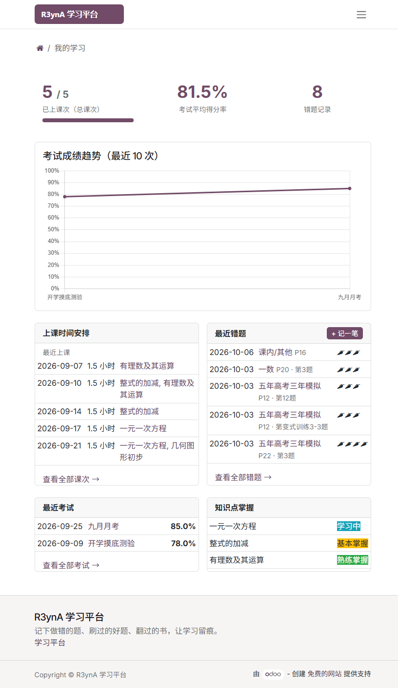
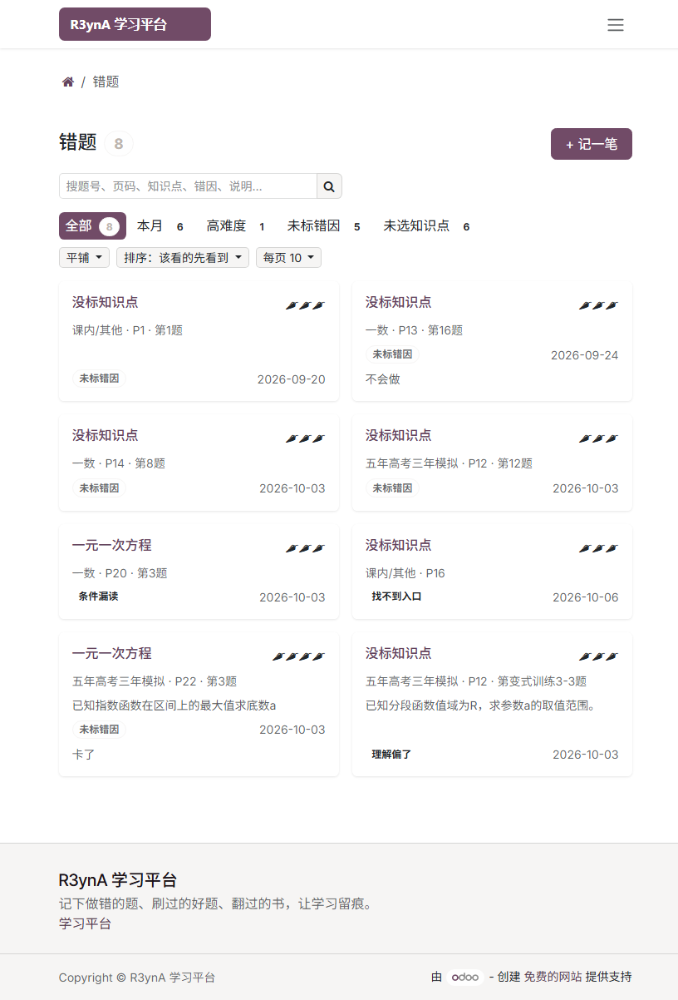
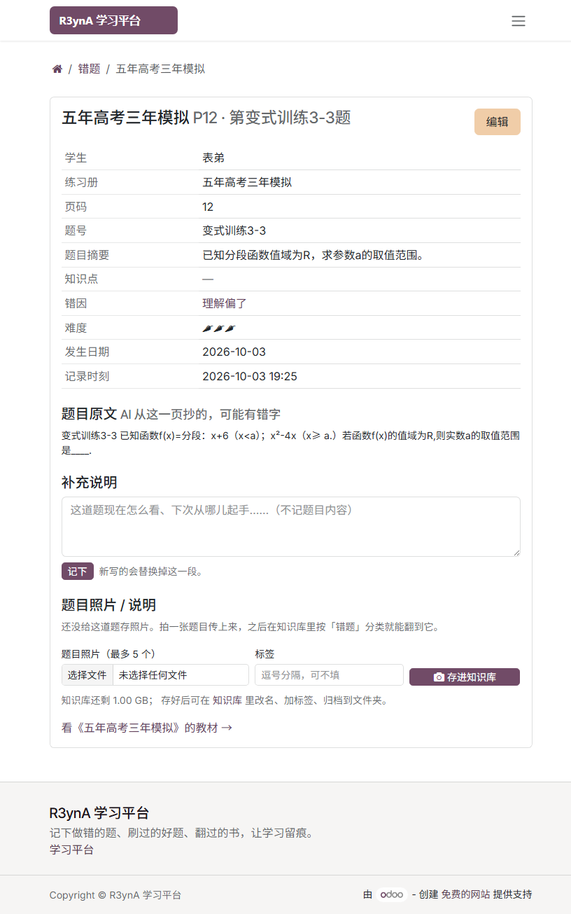
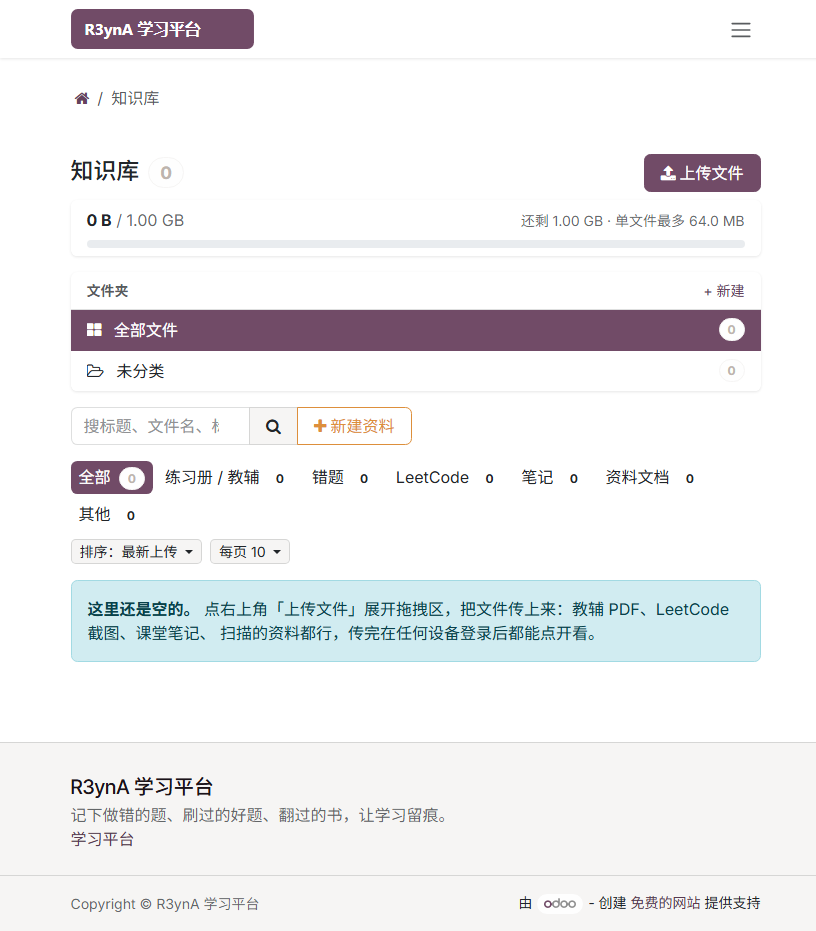
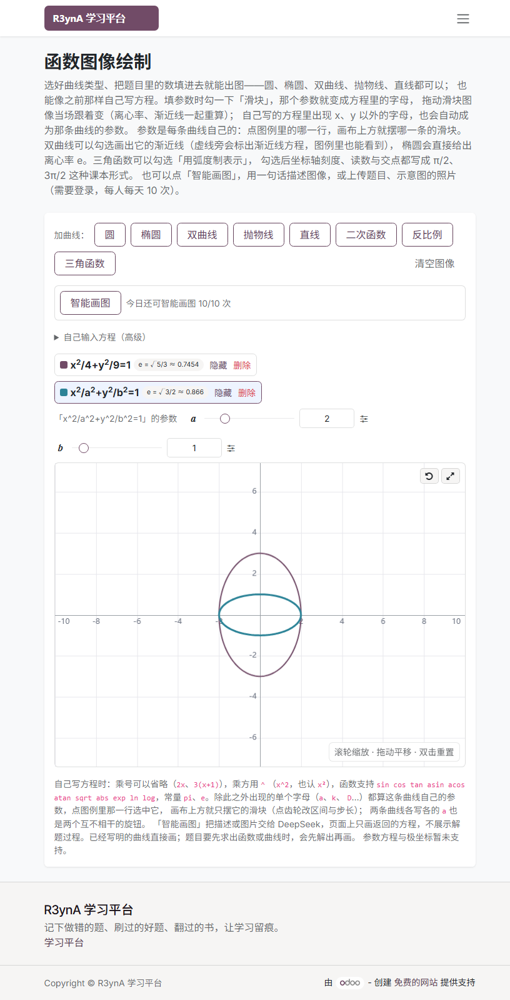
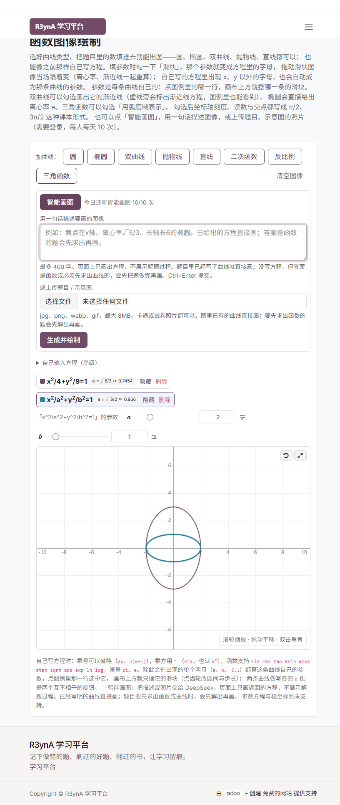

# R3ynA 学习平台

基于 **Odoo 19 社区版**的个人学习数据平台。要解决的问题很具体：**错在哪道题、那道题长什么样、这类题掌握到什么程度**。

核心是一个自研模块 `server/addons/tutoring_center`（25 个模型），网站首页只做平台门面，不含任何 ERP/CRM 入口。

## 三端

| 端 | 入口 | 做什么 |
|---|---|---|
| 教师后台 | 应用「R3ynA 学习」 | 学生档案、辅导课次、在校考试成绩、知识点树、错因字典、练习册与教材、知识库、错题看板 |
| 学生 / 家长门户 | `/my/learning`、`/my/mistakes`、`/my/library`、`/my/time` | 看课次与成绩、自助记错题、在线阅读教材、管理自己的文件与时间记录 |
| 公开工具 | `/tools/function-plot` | 函数图像成图器，无需登录 |

顶栏上访客看得到 首页 / 学习平台 / 错题 / 函数图像，登录后再多出 知识库 与 时间账本（这两项挂了用户组）。多学生之间按门户联系人硬隔离，跨学生访问直接 404。

## 界面速览

以下截图来自本机运行实例（`19.0.1.26.0`），门户用演示账号「表弟」。

**学生 / 家长门户**

| 学习首页 | 错题卡片页 | 错题详情（AI 抄回的题目原文与摘要） | 知识库 |
|---|---|---|---|
|  |  |  |  |

**公开工具 · 函数图像**（`/tools/function-plot`，无需登录即可成图；「智能画图」需登录）

| 参数滑块：方程写成 `x²/a²+y²/b²=1`，拖一下离心率跟着重算 | 智能画图：一句话或一张题目照片，只收回方程 |
|---|---|
|  |  |

> 教师后台（错题看板、练习册阅读台）的截图还欠着。

## 亮点

**错题只记出处，不抄题目。** 一条错题 = 哪本练习册 + 第几页 + 第几题 + 辣椒难度 2~5 + 错因 + 知识点。题目正文不进平台——记错题的目的是知道哪儿薄弱，不是把网站当题库。错因是内置字典（概念/审题/运算/策略/习惯/其它六类，预置 13 条，可自由增改），知识点的挑选域按学生年级放开，服务端在门户 POST 里再校一次年级，不信任下拉。

**复习队列是隐式的。** 打开一次详情就算复习过一次，按 1→3→7→15→30→60 天往后推到期日，列表默认顺序就是"到期最早的排最前"。界面上不出现"复习/待复习/已掌握"任何字样，错题上也没有订正状态字段——没人会做完一道题再回网站改状态。

**看一页教材，不必拉整本。** 练习册可以声明书页码与 PDF 页号的换算关系（`page_mode` + `page_offset`），系统就把那一页从整本里抽出来单独存成小 PDF，同页多题共用一份缓存。之所以要抽：核心的 `/web/content` 不支持 Range 请求，直接指整本文件等于为了看一页把几十 MB 全灌进浏览器。错题详情页右下角直接显示这道题所在的那一页原页。

**知识库是每个人自己的内容空间。** 1GB 配额、单文件 ≤64MB，分类（练习册/错题/leetcode/笔记/文档/其它）只是条目上的一个字段，不限制内容类型。支持文件夹收纳、拖拽上传逐文件进度、标签、Markdown 服务端渲染与纯文本就地编辑（不引第三方库）。练习册是它的一个分类（委托继承到条目表），所以教材同样占配额、可搜索、删除即释放空间；在知识库里把一条资料标成「练习册/教辅」会自动立起一本同名练习册，没电子版也能先记名字、附件什么时候有什么时候补。

**AI 只负责"看清题目"，不负责解题。** 在错题详情页发起一次，服务端定位这条错题对应的那一页教辅，把**那一页的扫描图**交给 DeepSeek，抄回题目原文、生成一句摘要、并从该学生年级的候选知识点里逐字挑一个（候选里没有就如实留空，人工填过的一律不动）。每人每天 5 条额度，一题只许发起一次，成败都扣；我们自己的代码出错则不扣并写明原因。执行走 `ir.cron` 异步排队。

**函数图像页在对标 Desmos。** `/tools/function-plot` 公开可用：八类曲线（圆/椭圆/双曲线/抛物线/直线/二次/反比例/三角）照题目里出现的参数直接填，椭圆与双曲线各有"分母式"和"系数式"两种填法，也能自己写方程。方程里出现 `x`、`y`、`pi`、`e` 与函数名之外的单个字母就自动长出**参数滑块**——参数是每条曲线自己的，点图例里那一行选中哪条就只摆哪条的旋钮，离心率与渐近线跟着拖动实时重算。双曲线可勾「画渐近线」并附带方程，三角函数可勾「刻度与交点用弧度制 π 表示」，预览按数学写法渲染（上标、π、去多余括号）。还支持滚轮缩放、拖动平移、悬停读数、画布全屏，纯前端计算、零第三方依赖。

**「智能画图」把出题人的一句话变成曲线。** 同一页上可以输入一句自然语言、一段题目文字，或者直接上传一张题目照片，交给 DeepSeek 后**只收回方程**（不让它画图、不让它解题），回到浏览器走同一条成图路径；识图比纯文本慢，超时给到 60 秒。每人每天 10 次，空输入、超长、没密钥、超时、连不上都不计数，接口返回 200 才计数。

**时间账本接住了桌面端工具。** 维护者自研的 JavaFX 计时器 Do1ng 现在能把任务与计时同步到云端五张表：每行带客户端生成的 `client_id`（多机重复上报只落一行）、删除是墓碑、冲突用服务端发的 `rev` 做乐观锁（不比较客户端时间戳，多机本地时钟不可信），时区按行存偏移加一列"当地日期"。门户 `/my/time` 看得到。

**防误触是贯穿后台的一条线。** 列表默认只读，单击整行打开只读"页中页"，要改数值或加行必须走「新建」「修改」这些明确的按钮；Excel 式逐行连填只留在学生档案的可编辑网格里。

**老师本人也是学习者。** 每位教师账号自动得到一份名为「我自己」的学习档案，能给自己记错题、传题目照片，落的是他本人那份行级隔离的数据；同事之间看不到彼此的私人档案及其错题。

## 数据模型一览

| 分组 | 模型 |
|---|---|
| 学生与教学 | `tutoring.student`、`tutoring.knowledge.point`（`parent_id` 自关联成树：年级 → 专题 → 考点）、`tutoring.student.point`（掌握度四档）、`tutoring.session`（课次）、`tutoring.topic`（教学内容标签，供课次与考试明细用）、`tutoring.exam` + `tutoring.exam.line`（在校考试） |
| 练习册与教材 | `tutoring.workbook`、`tutoring.workbook.file`（正文以 `bytea` 直接存在 PostgreSQL 里，`pg_dump` 即全量备份）、`tutoring.workbook.page`（服务端抽出的单页缓存）、`tutoring.workbook.goto`（按页码定位向导） |
| 错题 | `tutoring.mistake`、`tutoring.mistake.cause`（错因字典）、`tutoring.mistake.quickadd`（速记向导）、`tutoring.mistake.ai.job`（AI 任务流水） |
| 知识库 | `tutoring.library.item`、`tutoring.library.folder`、`tutoring.library.tag`（三张表都挂"仅本人"记录规则） |
| 时间账本 | `tutoring.time.task` / `.session` / `.pool.item` / `.device` / `.sync` |
| AI 画图 | `tutoring.plot.ai.call`（每次调用的发起人、自然日、状态、token、原文） |

其它改造：联系人全局简化视图并与学生档案双向联动；门户 `/my` 对绑定学生档案的账号直跳 `/my/learning`；模块自带一套高中知识点（11 专题 / 87 考点，取自《53A 数学精讲册》目录，`noupdate=1` 故教师改动不会被升级还原，换书重导用 `dev/gen_knowledge_data.py`）；被隐藏的原生应用菜单可通过安全组恢复。

## 仓库内容

| 路径 | 内容 |
|---|---|
| `server/addons/tutoring_center/` | 核心自定义模块（application，依赖 `portal`、`website`、`contacts`） |
| `odoo.conf.example` | 配置模板，复制为 `odoo.conf` 后填密码（真配置含密码，不入库） |
| `docs/R3ynA学习平台使用说明.md` | 面向使用者的操作说明 |
| `dev/` | 演示数据脚本、品牌设置、RPC 进程内升级、临时验收账号等运维脚本 |
| `docker-compose.yml` | 协作者一键开发环境（Odoo 19 + PostgreSQL 18 容器，含热重载） |
| `.agent/` | 协作须知：[handoff](.agent/handoff.md)（交接要点+协作规则）、[MULTI_AGENT](.agent/MULTI_AGENT.md)（多 agent 并发协作规范：谁部署、怎么独占、什么才算交付完）、[ONBOARDING](.agent/ONBOARDING.md)（安装配置指南）、[service-control](.agent/service-control.md)（服务启停与体检 skill）、[updates](.agent/updates)（按日期的更新记录） |

> Odoo 本体源码、Python 运行时、数据库备份、`odoo.conf`、日志等本机安装产物**不入库**，见 [.gitignore](.gitignore)。

## 快速开始（协作者）

**推荐原生 Windows 安装**（与维护者环境同构，完整步骤见 [.agent/ONBOARDING.md](.agent/ONBOARDING.md)：PostgreSQL 18 + Python 3.12 + Odoo 19 源码 + 本仓库模块，含关键模板库陷阱与热重载开发流程）。

若倾向容器化（步骤最少），装有 Docker 的机器上：

```bash
git clone https://github.com/liquidsax/Odoo_Edu.git
cd Odoo_Edu
docker compose up -d        # 首次启动自动建库 + 安装 tutoring_center + 中文语言包
```

启动完成后：

- 浏览器打开 http://localhost:8069 —— 教师后台（首次账号 `admin` / `admin`，**请立即改密**）；
- 需要演示数据时执行 `./dev/seed_docker.sh`（Windows 可在 Git Bash 中运行）。

### 边开发边看效果（热重载）

`docker-compose.yml` 已带 `--dev=xml,qweb,reload`，模块源码是从仓库目录**直接挂载**进容器的：

| 改什么 | 生效方式 |
|---|---|
| 视图/数据 XML | 保存后**刷新浏览器**即生效 |
| QWeb 模板/前端 JS | 同上 |
| Python 模型/控制器 | 保存后容器**自动重启**（`--dev=reload`），稍候刷新即可 |

个别情况（如改 manifest、加字段后视图报错）需要手动升级模块：

```bash
docker compose exec odoo odoo -d edu_dev --db_host=db --db_user=odoo \
    --db_password=odoo -u tutoring_center --stop-after-init
docker compose restart odoo
```

清空环境重来：`docker compose down -v`（会删除容器内数据库与附件，不影响仓库代码）。

> 端口占用时把 compose 里的 `"8069:8069"` 改成如 `"18069:8069"`；容器内账号密码均只作用于本地开发库，勿填真实凭据。

## 本地部署（参考，维护者当前环境）

1. 安装 Odoo 19 社区版 + PostgreSQL（Windows 下注意 `db_template` 需为 C/C 排序规则的模板库，不能是 `template0`）；
2. 将 `server/addons/tutoring_center` 加入 `addons_path` 指向的自定义模块目录；
3. 升级安装模块：`odoo-bin -c odoo.conf -d <数据库名> -u tutoring_center --stop-after-init`；
4. 教师后台用 admin 登录，门户账号由教师在「学生档案 → 门户账号 → 授权门户访问」创建并直接设置初始密码（平台未开放自助注册）。

运行 `dev/seed_data.py`（在 `odoo-bin shell` 中执行）可生成演示学生、知识点、课次、考试与错题数据；演示账号密码通过环境变量 `TUTOR_DEMO_PW_A` / `TUTOR_DEMO_PW_B` 注入。

AI 相关的两处功能需要 DeepSeek 密钥：优先环境变量 `DEEPSEEK_API_KEY`，其次模块目录下的 `.env`（每次现读，改文件不必重启），最后是系统参数 `tutoring_center.deepseek_api_key`。管理员在函数图像页保存即可。

## 安全与协作约定

- **任何真实密码、数据库凭据、`odoo.conf`、会话 cookie、数据库备份、学生真实数据不入库**；
- 脚本中的账号密码一律走环境变量注入，默认值为占位符；
- 文档与代码中不得出现机器特定用户名路径，统一使用 `%USERPROFILE%` / `%LOCALAPPDATA%` 写法；
- 改动走新分支 + Pull Request，由管理员审查后合并，不直推 `main`；提交信息用中文，说清"改了什么、为什么"；
- 改了模块 Python 代码需重启服务并 `-u tutoring_center` 升级；纯 XML/前端资产变更也必须 `-u` 才会重建资产包，可用 `dev/upgrade_via_rpc.py` 进程内升级免重启。
