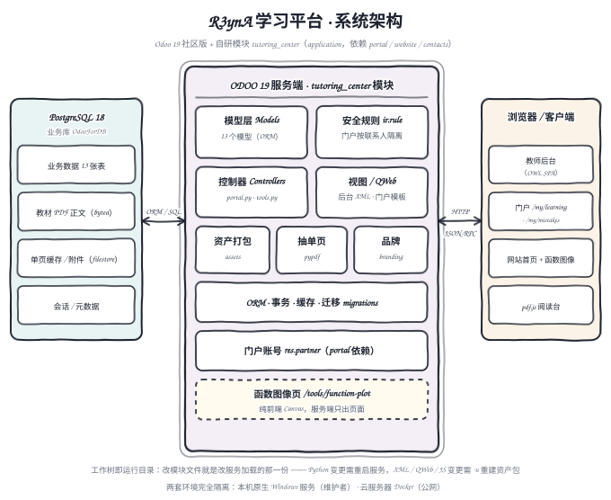
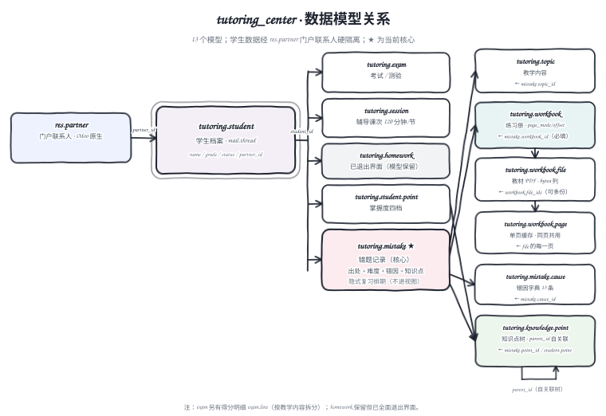
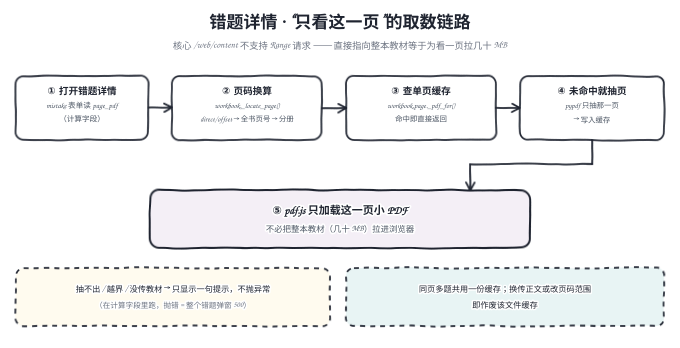

# R3ynA 学习平台 · 项目架构说明

> 面向接手本项目的协作者与 agent。读完本文应能：说清系统由哪几层构成、数据模型长什么样、
> 门户与后台各自怎么运转、几个"看起来反常"的设计为什么这么做。
> 运行步骤与安装配置看 [.agent/ONBOARDING.md](../.agent/ONBOARDING.md)；
> 交接要点与陷阱全集看 [.agent/handoff.md](../.agent/handoff.md)；
> 面向使用者的操作手册看 [R3ynA学习平台使用说明.md](R3ynA学习平台使用说明.md)。

- **模块版本**：`19.0.1.10.0`（`server/addons/tutoring_center/__manifest__.py`）
- **底座**：Odoo 19 社区版 · PostgreSQL 18 · Python 3.12
- **定位**：个人学习数据平台。教师端记录，学生/家长端查看与自助记录，多学生按门户联系人硬隔离。

> 本文的三张架构图由 `.workbuddy/scripts/gen_architecture_diagrams.py` 生成（该目录已 gitignore，
> 属本机工具链）。改图改脚本后重跑一次即可，图片落在 `docs/assets/`。

---

## 1. 系统总览



系统是**三层结构**，中间那层是自己写的代码，两侧都是现成的：

| 层 | 是什么 | 本项目做了什么 |
|---|---|---|
| **存储层** | Odoo 自己的 PostgreSQL 数据库 | 只新增 16 张业务表；教材 PDF 正文走 `bytea` 列（`pg_dump` 即全量备份），单页缓存走附件 |
| **服务端** | Odoo 19 框架 + 自研模块 `tutoring_center` | 13 个持久模型、2 个向导、门户控制器、后台视图、记录规则、前端资产、数据与迁移 |
| **客户端** | 浏览器 | 教师后台是 Odoo 原生 OWL 单页应用；门户是 QWeb + 少量自研前端；「函数图像」是纯前端 Canvas |

两侧的连接方式：左侧是 Odoo 的 ORM 生成 SQL（本模块**不写裸 SQL**，唯一的裸 SQL 在一次性迁移脚本里）；
右侧是 Odoo 的 HTTP/JSON-RPC 通道（后台走 RPC，门户与网站走普通 HTTP 渲染）。

**一个容易搞错的点**：本项目**没有"部署副本"**。仓库主工作树就是正在运行的安装目录 ——
服务加载的正是你手里在编辑的那一份 `server/addons/tutoring_center`。所以"改代码"到"线上生效"
之间只差一次模块升级（Python 变更还要加一次重启），不存在任何同步动作。

---

## 2. 技术栈与运行形态

### 2.1 依赖与外部库

模块只声明了三个依赖，其余全是 Odoo 自带的：

```python
'depends': ['portal', 'website', 'contacts']
```

| 能力 | 用的东西 | 谁提供的 |
|---|---|---|
| 数据与权限 | ORM、`ir.rule` 记录规则、`res.groups` | Odoo 核心 |
| 教师后台 | OWL 视图框架、`mail.thread` chatter | Odoo 核心 |
| 门户与网站 | `portal.CustomerPortal`、QWeb 模板、`website.layout` | Odoo 核心 |
| 成绩折线图 | Chart.js（`web.chartjs_lib` 资产包） | Odoo 核心 |
| 教材阅读 | pdf.js 静态查看器（`widget="pdf_viewer"`） | Odoo 核心 |
| **单页 PDF 抽取** | `odoo.tools.pdf`（pypdf 封装） | Odoo 核心（运行时依赖） |
| 函数图像绘制 | 自研表达式解析器 + Canvas 2D | **本模块** |

> 自研部分只用了浏览器原生 API 与 Odoo 内置库，**没有引入任何第三方前端依赖**。

### 2.2 两套环境，完全隔离

| 角色 | 环境 | 说明 |
|---|---|---|
| **维护者** | 原生 Windows 服务 | PostgreSQL 18 + Odoo 19 源码 + 本仓库模块；**本机不装 Docker** |
| **协作者（推荐）** | 原生 Windows | 与维护者同构，按 ONBOARDING 路径 A 自装 |
| **协作者（备选）** | Docker Compose | `docker compose up -d` 一键起 Odoo 19 + PG 18，数据一次性 |
| **使用端（公网）** | 云服务器 + Docker | 与本机完全独立的一套；其运维档案在**那台机自己的目录**里，不进仓库 |

两套环境**数据不互通**，也绝不能让原生 Odoo 与容器 Odoo 共用同一个数据库。

### 2.3 入口一览

| 入口 | 地址 | 面向 |
|---|---|---|
| 教师后台 | `/web` | 教师（`group_teacher`，admin 默认属于该组） |
| 学习总览 | `/my/learning` | 学生 / 家长 |
| 错题 | `/my/mistakes` | 学生 / 家长（顶栏独立入口） |
| 教材阅读 | `/my/learning/workbooks` | 学生 / 家长（只读） |
| 网站首页 | `/` | 公开门面，无 ERP/CRM 入口 |
| 函数图像 | `/tools/function-plot` | **公开**（`auth='public'`） |

---

## 3. 模块解剖

### 3.1 目录结构

```
server/addons/tutoring_center/
├── __manifest__.py          # 版本、依赖、data 清单、assets 打包清单
├── models/                  # 13 个持久模型 + 2 个向导
├── controllers/
│   ├── portal.py            # 门户全部路由（继承 portal.CustomerPortal）
│   └── tools.py             # /tools/function-plot 一个路由
├── views/
│   ├── tutoring_views.xml   # 后台视图 + 动作 + 菜单
│   ├── portal_templates.xml # 门户与 /my 全部模板
│   ├── website_templates.xml# 网站首页 + 函数图像页 + 顶栏菜单
│   ├── partner_views.xml    # 联系人简化视图（覆盖 contacts）
│   └── menus_cleanup.xml    # 菜单/视图清理的 function 触发器
├── static/src/              # 自研前端资产（见 3.6）
├── data/                    # 品牌、知识点库、错因字典、迁移回填 function
├── security/                # 组、记录规则、ACL
└── migrations/              # 版本化数据迁移（目前只有年级键值补零）
```

### 3.2 数据模型



**口径说明**：模块有 **15 个 `_name`**，其中 **13 个是持久模型**，2 个是 `TransientModel` 向导
（`tutoring.mistake.quickadd` 速记、`tutoring.workbook.goto` 按页码定位）。
handoff/README 里说的"13 个模型"指的是模型文件数（13 个 `.py`），不是 `_name` 数量。

| 模型 | 说明 | 要点 |
|---|---|---|
| `tutoring.student` | 学生档案 | `mail.thread`；`partner_id` 指向门户联系人，未填时自动建一个 |
| `tutoring.topic` | 教学内容 | 即输即建的标签，课次/考试明细/错题共用 |
| `tutoring.session` | 辅导课次 | `mail.thread`；日期 + 时长 + 内容标签 + 表现/计划 |
| `tutoring.exam` | 学校考试 | `mail.thread`；得分率由明细汇总（`store=True`） |
| `tutoring.exam.line` | 考试得分明细 | 按教学内容拆行；三处 `percentage` 均 `aggregator='avg'` |
| `tutoring.homework` | 作业 | **模型保留但已全面退出界面**（辅导模式改为纯讲题） |
| `tutoring.knowledge.point` | 知识点（树） | `parent_id` 自关联：年级 → 专题 → 考点；同名判重约束 |
| `tutoring.student.point` | 学生知识点掌握 | 四档（未掌握/学习中/基本掌握/熟练掌握） |
| `tutoring.mistake` | **错题记录（核心）** | 只记出处不记题目；难度 2~5🌶；带错因 + 知识点 + 隐式复习排期 |
| `tutoring.mistake.cause` | 错因字典 | 六类归类，预置 13 条，`noupdate=1` |
| `tutoring.workbook` | 练习册 | `page_mode` / `page_offset` 定义"书页码 → PDF 页号"的换算 |
| `tutoring.workbook.file` | 教材文件 | `content` 用 **`attachment=False`** → 正文就是 `bytea` 列 |
| `tutoring.workbook.page` | **单页缓存** | 从整本里抽出来的**一页**小 PDF，同页多题共用 |
| `tutoring.mistake.quickadd` | 错题速记向导 | Transient；题号 `1-5` / `1,3,7` 自动拆多条 |
| `tutoring.workbook.goto` | 按页码定位向导 | Transient；全书页号 → 分册 + 分册内局部页号 |

外键要点：

- `tutoring.student.partner_id` → `res.partner`：**门户隔离的锚点**，所有记录规则的域都从它出发；
- `tutoring.mistake.workbook_id` **必填**（`ondelete='restrict'`），`cause_id`/`topic_id` 也是 restrict，
  唯独 `point_id` 是 `set null` —— 删知识点不该连带删错题；
- `tutoring.mistake` 上还有三个**不进任何视图**的字段：`last_review_at` / `review_count` / `next_review_at`。

### 3.3 控制器与路由

两处控制器，一共 **17 条路由**：`controllers/portal.py`（16 条）与 `controllers/tools.py`（1 条）。
另外 `TutoringPortal` 还覆写了父类的 `home()`（`/my`），那不是新增路由而是改写行为。

| 路由 | 方法 | 作用 |
|---|---|---|
| `/my/learning` | GET | 学习总览（统计卡 + 成绩趋势图 + 最近课次/考试/错题/知识点） |
| `/my/learning/sessions` `/…/<id>` | GET | 课次列表 / 详情 |
| `/my/learning/homework` `/…/<id>` | GET | 作业列表 / 详情（功能保留） |
| `/my/learning/exams` `/…/<id>` | GET | 考试列表 / 详情（含按教学内容拆分的得分明细） |
| `/my/mistakes` | GET | **顶栏错题页**：速记条 + 带计数药丸 + 卡片网格 + 分组下钻 |
| `/my/learning/mistakes` | GET | 旧入口 → 302 到 `/my/mistakes` |
| `/my/learning/mistakes/<id>` | GET | 错题详情；**可写时调 `touch_review()`**（隐式复习） |
| `/my/learning/mistakes/<id>/note` | POST | 详情页就地补一句补充说明 |
| `/my/learning/mistakes/new` | GET/POST | GET 跳回速记条；POST 建单（题号可连记） |
| `/my/learning/mistakes/<id>/edit` | GET/POST | 编辑（**不允许改归属学生**） |
| `/my/learning/workbooks` `/…/<id>` | GET | 教材清单：按该生**用过的练习册**归集 |
| `/my/learning/workbook-files/<id>` | GET | 内嵌 pdf.js 阅读台 |
| `/tools/function-plot` | GET | 函数图像页（`auth='public'`，纯前端） |

三处刻意的实现约定：

1. **表单里的 id 一律不可信**。`_browse_allowed()` 把 POST 里的 id 先取记录、再 `has_access('read')`
   校验，通不过就当空处理；选择题的年级域在**服务端再校一次**（下拉里看不到 ≠ 塞不进来）。
2. **取数全部走服务端**。错题的域、排序、分页、分组都在 Python 里算，
   排序键走**白名单字典**（`_mistake_sortings()`），用户传的字符串永远不进 SQL。
3. **`home()` 被覆写**：已绑定学生档案的门户账号访问 `/my` 直接 302 到 `/my/learning`，
   不再看到 Odoo 原生门户首页。

### 3.4 安全模型

**两个组**（`security/tutoring_security.xml`）：

| 组 | 含义 |
|---|---|
| `group_teacher` | 教师：对全部业务模型 1/1/1/1。隐含 `base.group_user`，admin 默认加入 |
| `group_show_hidden_apps` | 恢复开关：加入即可重新看到被隐藏的 Odoo 原生应用菜单 |

**记录规则**：门户侧共 **12 条 `ir.rule`**，域全部锚在 `user.partner_id` 上：

| 模型 | 门户可见范围 | 可写 | 可建 | 可删 |
|---|---|---|---|---|
| `tutoring.student` | `partner_id = 本人联系人` | ✗ | ✗ | ✗ |
| `tutoring.session` / `exam` / `exam.line` / `homework` / `student.point` | `student_id.partner_id = 本人联系人` | ✗ | ✗ | ✗ |
| `tutoring.mistake` | `student_id.partner_id = 本人联系人` | **✓** | **✓** | ✗ |
| `tutoring.topic` / `knowledge.point` / `mistake.cause` / `workbook` / `workbook.file` | **全库可读**（`[(1,'=',1)]`） | ✗ | ✗ | ✗ |

两点值得说明（都是**有意的**）：

- **错题是唯一门户可写的模型**：学生自助记错题。写权限受记录规则约束（只能自己的），
  且不给 `unlink` —— 门户里删不掉记录，要删得回后台。
- **教材/知识点/错因/练习册是"共享教辅资料"**，所以门户侧全库可读。
  门户的 `/my/learning/workbooks` 只是**按该生用过的书归集**（`_tutoring_workbooks()`），
  并不是权限边界；知道 id 的公开教材本身不构成隐私问题，学生私有的东西（课次/成绩/错题）才受域限制。
- `tutoring.workbook.page`（单页缓存）**门户没有任何 ACL** —— 它是内部缓存，只服务后台阅读。

### 3.5 前端自研资产

`__manifest__.py` 的 `assets` 分两组加载，共 5 个自研文件：

| 文件 | 挂在哪 | 干什么 |
|---|---|---|
| `static/src/fields/chili_field.js` | `web.assets_backend` | 自定义字段 widget `chili`：把 Selection 渲染成可点辣椒 |
| `static/src/mistake_stats/*` | `web.assets_backend` | 错题页顶部**统计概览条** + 自定义 kanban/list 控制器 |
| `static/src/mistake_kanban/*` | `web.assets_backend` | 看板卡片样式 |
| `static/src/learning_charts.js` | `web.assets_frontend` | 门户成绩趋势折线图（Odoo 自带 Chart.js） |
| `static/src/function_plot.js` + `.css` | `web.assets_frontend` | 函数图像绘制器（2097 行，纯前端） |

两个技术细节，踩过坑的：

- `chili_field.js` 里 import 写的是**绝对别名** `@web/views/fields/standard_field_props`。
  照抄核心文件的相对路径会被 `js_transpiler` 按本模块解析 → 该模块不存在 → 组件**静默回退**成默认
  widget（界面上看起来"只是没变好看"，实际是加载失败）。
- 统计概览条与看板的扩展方式：自定义 `Controller` 的 `template` 继承 `web.KanbanView` / `web.ListView`，
  在 `<t t-component="props.Renderer">` 前插 banner；再通过 `js_class` 把视图挂上自定义注册项。
  卡片模板要拿分组字段，得自定义 `KanbanRecord` 覆写 `renderingContext` 塞 `groupByField`。

### 3.6 数据、迁移与品牌

| 文件 | 内容 | 为什么这么放 |
|---|---|---|
| `data/knowledge_data.xml` | 高中知识点 11 专题 / 87 考点（取自《53A 精讲册》目录） | `noupdate=1`：老师的改动不会被升级还原 |
| `data/mistake_cause_data.xml` | 错因字典 13 条 | 同上 |
| `data/mistake_data.xml` | 两个 `<function>` 回填（存量错题归入默认练习册、补复习排期） | 给"新加必填字段"的表加约束前先补存量数据 |
| `data/branding_data.xml` | 网站名 / logo / favicon / 页脚替换 | 见下方"为什么用 function" |
| `migrations/19.0.1.2.0/pre-migrate.py` | 年级键值补零 `'7'→'07'` | 见下方"为什么补零" |

**为什么品牌走 `<function>` 而不是 `<record>`**：`website.default_website`、`base.main_company`
这些 xmlid **自身带 `noupdate=1`**，升级时 Odoo 直接跳过别的模块创建的这类记录 —— 写 `<record>` 既不报错
也不生效。所以只能写 Python 函数去 `write()`。代价是：网站设置里手填的网站名/logo **每次升级都会被盖回**模块里这一份。

**为什么年级键值要补零**：Selection 在库里存字符串，`_order` 与"按年级分组"都按**值**比较，
`'10' < '7'` —— 不补零的话"高一"会排在"初一"前面，而知识点页默认就是按年级分组的那一屏。
改键值必须配 `migrations/<版本>/pre-migrate.py` 把存量行一起补零。

---

## 4. 关键机制（为什么这么做）

### 4.1 门户错题页：为"几百条还能用"设计

早期版本是"全量 `search()` → Python `sorted()` → 硬编码 `page_size=10` → 4 次 `search_count`"，
300 条就废了。现在：

- **取数**：`domain` + 白名单 `order` + `limit/offset`，都在服务端；
- **统计**：筛选药丸上的计数用 3 次 `read_group` 出（不是逐个 `search_count`）；
- **分组**：按知识点 / 错因 / 月份，**一次取回并封顶 400 条**（分组必须跨页才有意义，
  所以放弃分页器改封顶，并如实告诉用户被截断了）；组内只先给 8 条，点组标题**下钻**；
- **下钻条件**：拼在 Python 里而不是模板里 —— 模板里要反推"去掉 groupby、保留其它条件"，
  写出来既难读又容易丢条件。下钻条件以胶囊显示，`×` 可单独摘掉；
- **详情页**可就地补一句补充说明（`POST …/note`），不必跳去整张编辑表重填。

### 4.2 隐式复习队列：不让学生维护状态

`tutoring.mistake` 上有三个**不进任何视图**的字段，门户错题页的默认排序就是它：

```
打开详情（GET）→ touch_review()：记时刻、review_count +1、
next_review_at = now + REVIEW_INTERVALS_DAYS[min(review_count, 5)]
REVIEW_INTERVALS_DAYS = (1, 3, 7, 15, 30, 60)
```

默认 `sortby=review` 即 `next_review_at asc`，于是"该看的先看到"。学生看不到任何
"复习 / 待复习 / 已掌握"字样，也不需要点任何"标记已复习"按钮 —— **翻这道题这个动作本身就是复习**。
封顶 60 天：个人自用，间隔再长就等于不再会翻到。

> 升级时 `_migration_backfill_review` 会把存量行的 `next_review_at` 回填成 `create_date` ——
> 不回填的话 PostgreSQL 把 NULL 排在升序末尾，老错题会**永久沉底**。

### 4.3 "只看这一页" —— 单页 PDF 抽取与缓存



上线背景是一个硬约束：核心 `pdf_viewer` 用 `/web/content?model=&field=&id=` 取文件，
而**该路由不支持 Range 请求**（整个 Odoo 源码里没有任何 `Accept-Ranges`）。
直接指向整本教材 = 为了看一页把几十 MB 全拉进浏览器。

于是服务端用 `odoo.tools.pdf`（pypdf）把**那一页**单独抽成一份小 PDF 缓存下来：

- `tutoring.workbook._locate_page(page)` 把使用者填的页码翻译成"**哪份分册的第几页**"；
- `tutoring.workbook.page._pdf_for(file, local)` 先查缓存，命中直接返回；未命中才抽页并落库；
- 换传正文或改页码范围 → `tutoring.workbook.file.write()` 触发 `_invalidate_for_files()` 作废该文件的缓存；
- **失败一律不抛异常**（返回 `False` + 一句提示）：它在**计算字段**里跑，抛错等于把整个错题弹窗打成 500。

### 4.4 大 PDF：物理拆、逻辑不拆

Odoo 的上传上限实际卡在 **128MiB 请求体**（见第 6 节的陷阱），base64 换算后**单文件约 96MB** 到顶。
所以一本厚书按页切成几份挂进同一本书：`page_from` / `page_to` 记**全书连续页号**，
使用者心里始终只有"这本书的第 80 页"。

配套两个东西：

- `tutoring.workbook.page_mode` / `page_offset`：定义"书印刷页码 → PDF 页号"的换算
  （53 资料实测：印刷页 + 8 = PDF 页号）。`_pdf_page_for()` 先算出全书连续 PDF 页号；
- 阅读台头部「按页码定位」（`tutoring.workbook.goto`）：输一个全书页号 → 自动挑出含这一页的分册
  → 靠核心组件认的钩子字段 `content_page` 跳到分册内的局部页号。

样板：《五年高考三年模拟》已按 1–55 / 56–110 / 111–164 页存成 3 份。

### 4.5 后台错题页：看板 + 统计概览条

- **默认视图是按学生分栏的卡片看板**（`view_tutoring_mistake_kanban`），栏头带难度分布进度条；
- 整卡点击 → 只读详情页中页（`<kanban action="action_open_reader" type="object">`，19 原生支持）；
  要改内容（含难度辣椒）必须点详情页里的「修改」；
- 列表页同理：单击整行进只读详情，改/加都走明确按钮 —— **杜绝"一碰就改库"**；
- 顶部**统计概览条**（共 N 条 / 本月新增 / 高难度 / 未填错因）由 `summary_stats()` 取数，
  除总数外三个数字**点击即切换对应筛选**；
- 视图切换器还有**图表页签**（柱状按月）；
- **Excel 式逐行连填仍在学生表单的「错题记录」页签**（那里是 `editable="bottom"` 网格）。

### 4.6 函数图像页（纯前端）

`/tools/function-plot` 是公开页，服务端只负责出模板，**计算与绘制全在浏览器**：

- 自研表达式解析：`normalizeExpression → tokenize → toRPN → compileRPN`（支持 `^`、隐式乘号、
  `sin/cos/…/sqrt/abs/exp/ln/log`、常量 `pi`/`e`）；
- `CURVE_TYPES` 表把"按类型添加"的每种曲线定义成 `{modes, fields, compose}`，
  `compose()` 负责把题目里的数拼成方程；椭圆/双曲线有「分母式」与「系数式」两种填法；
- 渲染走 Canvas：显式函数直接采样，隐式方程（`strokeImplicit`）按 grid cell 的符号变化找零点，
  双曲线两支断开不连线；支持滚轮缩放、拖动平移、悬停读数、全屏；
- **数学写法渲染**：`prettyEquation()` 把 `x^2/5+y^2=1` 写成上标形式；`radicalText()` 尽量把离心率
  写成课本根式（`√5/3 ≈ 0.7454`）；`piStep()`/`piTick()` 让三角函数轴刻度写成 `π/2`、`3π/2`；
  双曲线画渐近线时会带上方程（`asymptoteLineText()` / `asymptoteSummaryText()`）。
- 离心率与渐近线**跟着曲线对象走**（`addCurve(expr, meta)`）：只有「按类型添加」和预置示例会带上，
  **自己写方程不带** —— 没做通用二次曲线识别，这是明确的边界。

### 4.7 品牌与"平台门面"

- 网站首页被替换成教育门面（四张能力卡），**不出现任何 ERP/CRM 入口**；
- 后台顶栏只留「R3ynA 学习（学生 / 错题 / 练习册 / 知识点 / 错因）」+ 联系人 + 网站 + 设置；
  被隐藏的原生应用（应用/讨论/项目/邮件营销/调查/员工/仪表板）通过 `group_show_hidden_apps` 可恢复；
- 联系人（`res.partner`）换成简化视图，`tutoring_school` 与学生档案**双向联动**（compute + inverse）。

---

## 5. 运维与升级

**标准升级（Python 变更必须走这条）**：

```
停服 → odoo-bin -c odoo.conf -d <库名> -u tutoring_center --stop-after-init → 起服
```

- **纯 XML / 数据变更**可以免重启：`odoo-bin shell … < dev/upgrade_via_rpc.py`（脚本内
  `button_immediate_upgrade()`，运行中的服务经 signaling 自动重载）。
  在 Windows 上跑带中文注释的脚本**必须带 `PYTHONUTF8=1`**；
- **新增 Python 模型类 / 控制器必须重启**：运行中的服务无法加载新类；纯字段/视图变更无此限制；
- **前端资产（`static/src` 的 JS/CSS）也走标准升级**：资产包只在模块升级时重建，
  改完刷新页面看不到变化。就地升级**不触发 assets 失效信号**，必要时删掉
  `web.assets_backend.min.js/.css` 两条 `ir.attachment` 让下次请求按磁盘新代码重建；
- **验收要用一次性新库跑一次 `-i tutoring_center`**（跨模块引用只有全新库才暴露）；
- 服务启停与体检统一走 skill 提供的 `svcctl.ps1`（`status` / `check` / `start` / `stop` / `restart`），
  不要手搓 `Start-Service`。

**协作红线**（详见 [.agent/handoff.md](../.agent/handoff.md) 与 [.agent/MULTI_AGENT.md](../.agent/MULTI_AGENT.md)）：

1. 开工先 `git checkout main && git pull`；**禁止直接向 `main` 推送**，一律 `feature/*` / `fix/*` + PR；
2. 共享实例独占：`E:\Odoo` 是**唯一一份**工作树，多个 agent 改的是同一个目录；
   `stop/start`、`-u`、改系统参数都算独占动作，别人占用期间**只写不部署**；
3. 不提交真实密码 / 凭据 / `odoo.conf` / 数据库备份 / 学生真实数据 / 截图素材；
   不硬编码本机绝对路径（文档中用 `%USERPROFILE%` / `%LOCALAPPDATA%`）；
4. 密码类参数一律走环境变量注入（参考 `dev/seed_data.py` 的 `TUTOR_DEMO_PW_A/B`）。

---

## 6. 设计取舍与已知陷阱（精选）

完整清单见 handoff §五（19 条）与 `.agent/updates/` 各日记录，这里只留最影响判断的：

| 主题 | 结论 |
|---|---|
| **模板库排序规则** | Windows 上必须用 `db_template = odoo_template_c`（纯 C 排序），不能是 `template0`，否则建出的库直接无法连接。**已存在库的排序规则改不了，错了只能删库重建**。 |
| **跨模块引用** | 用别人模块的记录（`<record id="contacts.action_contacts">`、`inherit_id="project.*"`）必须声明依赖，否则**全新库装不上**（维护者的库因为是从完整 ERP 库改造而来，永远发现不了）。纯清理/装饰性的引用改用容错函数 `env.ref(..., raise_if_not_found=False)`。 |
| **前端点击被吞** | 在容器上对 `pointerdown` 调 `preventDefault()` 会抑制浏览器合成的 `mousedown`/`click`，容器内按钮彻底点不动。脚本里的 `element.click()` 会掩盖此问题 —— **交互控件必须真机点击验收**。 |
| **上传天花板** | 不是 `web.max_file_upload_size`（那个系统参数对 `/web/dataset/*` 的写无效），而是 `http.py` 里硬设的 **128MiB 请求体**，base64 换算后单文件 ≈96MB 到顶，且多份不能攒在一次保存里提交。 |
| **Binary 存哪** | `fields.Binary` 默认 `attachment=True` → 正文进 filestore，库里只有元数据；要"文件就在 PostgreSQL"必须写 `attachment=False`（列变 `bytea`，存的是 base64 文本，库体积 ≈ 文件的 4/3）。 |
| **弹窗尺寸与 footer** | 尺寸走 context 键 `dialog_size`；但 context 的 `footer: False` **只能配 client action** —— 给表单弹窗用会让 Dialog 连 `<footer>` 都不生成，按钮插槽的 portal 找不到目标直接崩，且服务端全是 200、只在浏览器 console 看得见。想要"打开就是看"就在 arch 里写显式 `<footer>`。 |
| **列表常驻按钮** | 用 `<header><button … display="always"/></header>`（19 原生渲染进 `control-panel-always-buttons` 插槽）；方法上**不要加 `@api.model`**（列表按钮 RPC 恒以 `[ids]` 为首个位置参数，加了必 `TypeError`）。`icon` 只认 `fa-` / `oi-` 前缀。 |
| **并发升级吃迁移** | Odoo 执行迁移的区间是 `(latest_version, 新版本]`。两路并发把版本写成同一个号时，先升级的那次会让另一方的 `migrations/<版本>/` 被**静默跳过**。别人有未合并改动时不要升级业务库。 |
| **视图优先级** | 核心视图 `base.view_partner_form` 是 `priority=1`，自定义的默认视图要 `priority=0` 才能稳定胜出。 |
| **门户 QWeb 两个坑** | 表单取 CSRF 令牌要用 `request.csrf_token()`（裸 `csrf_token()` 会 `KeyError` → 500）；分页器写 `<t t-call="portal.pager"/>`（误用 `t-out` 会把字典原样打印到页面底部）。 |
| **数据库字段判重约束** | 换定义可以（Odoo 会 DROP 再 ADD），但**属性名不能改** —— 改了旧约束就没人认领，永久留在库里继续拦数据。 |

---

## 7. 文档索引

| 文档 | 内容 |
|---|---|
| [.agent/handoff.md](../.agent/handoff.md) | 工作交接：协作规则、项目定位、环境、高频操作、**19 条陷阱** |
| [.agent/MULTI_AGENT.md](../.agent/MULTI_AGENT.md) | 多 agent 并发规范：独占规则、部署标准动作、版本号礼仪、验收要求 |
| [.agent/ONBOARDING.md](../.agent/ONBOARDING.md) | 从零安装：路径 A 原生 Windows（完整步骤）/ 路径 B Docker + 自检清单 |
| [.agent/service-control.md](../.agent/service-control.md) | 服务启停与体检（`svcctl.ps1`）：UAC 规则、六层 `check`、失败判读 |
| [.agent/updates/](../.agent/updates/) | 按日期的完整更新记录（含实测数据、验证记录、陷阱全表） |
| [R3ynA学习平台使用说明.md](R3ynA学习平台使用说明.md) | 面向使用者的操作手册 |
| 根 [README.md](../README.md) | 项目总览、模块概览、快速开始 |

---

*本文由代码通读整理而成，与 `19.0.1.10.0` 版本的实现对得上。若发现描述与代码不符，以代码为准并顺手更新本文。*
